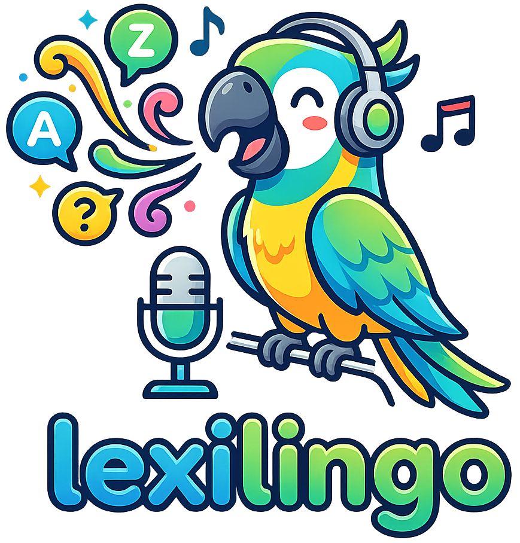

<div align="center">



# LexiLingo — Your AI Language Learning Assistant

---

[](https://flutter.dev)
[](https://fastapi.tiangolo.com)
[](https://www.python.org)
[](https://www.postgresql.org)
[](LICENSE)
[](https://github.com/InfinityZero3000/LexiLingo)

LexiLingo is an enterprise-grade language learning platform that leverages artificial intelligence and machine learning to provide **personalized, adaptive learning experiences**. Powered by fine-tuned LLMs, knowledge graphs, and a real-time voice pipeline, LexiLingo helps learners master English through intelligent assessments, conversational AI tutors, and gamified learning paths.

</div>

---

## Key Highlights

| Feature | Description |
|---------|-------------|
| **GraphCAG Pipeline** | **Graph** (Knowledge Graph) + **CAG** (Cache-Augmented Generation) orchestrated by LangGraph |
| **Dual-Stream Voice** | Real-time concurrent STT → Thinking → TTS with interruption handling |
| **Smart Model Router** | Automatic routing between local (Ollama) and cloud (Gemini) models |
| **CEFR Assessment** | Automatic proficiency scoring from A1 to C2 with multi-dimensional analysis |
| **Knowledge Graph** | KuzuDB-backed curriculum graph with mastery tracking and concept prerequisites |
| **HuBERT Pronunciation** | Phoneme-level pronunciation feedback optimized for Vietnamese learners |
| **SM-2 Spaced Repetition** | Optimal review scheduling based on SuperMemo 2 algorithm |
| **Content Auto-Generation** | AI-generated exercises adapted to learner level, errors, and interests |

---

## System Architecture

LexiLingo implements a **microservices architecture** with three specialized backend services:

```
┌─────────────────────────────────────────────────────────────────┐
│                        Client Layer                             │
│              (Flutter - iOS / Android / Web)                    │
└────────────────────────────────┬────────────────────────────────┘
                                 │
                                 ↓
┌─────────────────────────────────────────────────────────────────┐
│                      API Gateway Layer                          │
│                   (Load Balancing / Routing)                    │
└────────────────────────────────┬────────────────────────────────┘
                                 │
           ┌─────────────────────┼─────────────────────┐
           ↓                     ↓                     ↓
     ┌───────────┐         ┌───────────┐         ┌───────────┐
     │  Backend  │         │    AI     │         │ DL Model  │
     │  Service  │         │  Service  │         │  Service  │
     └─────┬─────┘         └─────┬─────┘         └─────┬─────┘
           │                     │                     │
           └─────────────────────┴─────────────────────┘
                                 │
                      ┌──────────┴──────────┐
                      ↓                     ↓
                ┌──────────┐          ┌──────────┐
                │PostgreSQL│          │  Redis   │
                │ Database │          │  Cache   │
                └──────────┘          └──────────┘
```

---

## AI Architecture Deep Dive

### GraphCAG Pipeline (LangGraph StateGraph)

The core intelligence of LexiLingo is the **GraphCAG Pipeline** — a combination of **Graph** (Knowledge Graph via KuzuDB) and **CAG** (Cache-Augmented Generation), orchestrated by **LangGraph's StateGraph**.

Unlike traditional RAG (Retrieval-Augmented Generation) that retrieves from documents, **CAG grounds LLM responses using cached learner context** (Redis: learner profiles, conversation history) and **structured knowledge** (KuzuDB: grammar concepts, prerequisite chains, mastery scores). This makes responses faster and more contextually relevant without redundant document retrieval.

```
┌───────────┐   ┌───────────┐   ┌───────────┐
│   INPUT   │──▶│ KG_EXPAND │──▶│ DIAGNOSE  │
│  (Cache   │   │  (KuzuDB  │   │ (AI Error │
│   Load)   │   │   Hops)   │   │  Detect)  │
└───────────┘   └───────────┘   └─────┬─────┘
                                      │
           ┌──────────────────────────┼───────────────────┐
           ▼                          ▼                   ▼
    ┌────────────┐             ┌────────────┐      ┌────────────┐
    │ASK_CLARIFY │             │ VIETNAMESE │      │  RETRIEVE  │
    │(conf < 0.5)│             │ (A1/A2 +   │      │(KG + Vector│
    └──────┬─────┘             │  errors)   │      │  Context)  │
           │                   └──────┬─────┘      └──────┬─────┘
           │                          │                   │
           │                          └───────────────────┤
           │                                              ▼
           │                                       ┌────────────┐
           └──────────────────────────────────────▶│  GENERATE  │
                                                   └──────┬─────┘
                                                ┌─────────┴─────────┐
                                                ▼                   ▼
                                          ┌───────────┐       ┌───────────┐
                                          │    TTS    │       │    END    │
                                          └─────┬─────┘       └───────────┘
                                                │
                                                ▼
                                          ┌───────────┐
                                          │    END    │
                                          └───────────┘
```

**Pipeline flow (from actual LangGraph StateGraph):**

1. **Input Node** — Loads learner profile and conversation history from **Redis cache** (CAG)
2. **KG Expand Node** — Matches user input to curriculum concepts in **KuzuDB**, expands via graph hops to find related concepts (Graph)
3. **Diagnose Node** — AI-powered grammar/fluency analysis via **ModelGateway** (Qwen/Gemini), maps errors to KG concept IDs
4. **Conditional Routing** — LangGraph conditional edges:
   - `confidence < 0.5` → **Ask Clarify** (request more info)
   - `level A1/A2 + errors` → **Vietnamese Node** (explain in Vietnamese first) → Retrieve
   - Otherwise → **Retrieve** (normal flow)
5. **Retrieve Node** — Combines KG-expanded concepts + diagnosis root causes into a grounded context
6. **Generate Node** — LLM generates a personalized tutor response using the cached context (CAG), grounded by KG concepts (Graph)
7. **TTS Node** — Conditionally generates speech output via Piper TTS

Each node updates the shared **`GraphCAGState`** (TypedDict), enabling stateful multi-turn conversations with full context preservation.

---

### Model Gateway & Smart Router

LexiLingo uses a **unified Model Gateway** to manage all AI model lifecycles:

```
┌─────────────────────────────────────────────────────────────────┐
│                          MODEL GATEWAY                          │
│                                                                 │
│       ┌──────────┐   ┌──────────┐   ┌──────────┐                │
│       │  Gemini  │   │  Ollama  │   │   Qwen   │                │
│       │  (Cloud) │   │  (Local) │   │   (DL)   │                │
│       └────┬─────┘   └────┬─────┘   └────┬─────┘                │
│            │              │              │                      │
│            └──────────────┼──────────────┘                      │
│                           │                                     │
│                 ┌─────────┴─────────┐                           │
│                 │   Smart Router    │                           │
│                 │   (Complexity     │                           │
│                 │    Analysis)      │                           │
│                 └───────────────────┘                           │
│                                                                 │
│  Features:                                                      │
│  • Lazy loading — Models load on first request                  │
│  • Auto unload — Free RAM after idle timeout                    │
│  • Memory management — Track & cap usage (~8GB)                 │
│  • Priority system — Critical > High > Normal > Low             │
│  • Health monitoring — Background scheduler                     │
└─────────────────────────────────────────────────────────────────┘
```

**Smart Router** analyzes text complexity and routes to the optimal model:
- **Simple greetings** → Local fast model (gemma2:2b, ~3s latency)
- **Grammar analysis / technical** → Cloud model (Gemini, ~2s latency)
- **Deep language analysis** → Local quality model (qwen3:4b-thinking, ~20s latency)

**Multi-Provider Fallback Chain:** `OpenRouter → Gemini → Ollama (Local)`

---

### Dual-Stream Real-Time Voice

LexiLingo implements a **Dual-Stream architecture** for real-time voice conversations with the AI tutor — three concurrent async streams running simultaneously:

```
┌───────────────┐     ┌───────────────┐     ┌───────────────┐
│   LISTENING   │     │   THINKING    │     │   SPEAKING    │
│    Stream     │────▶│    Stream     │────▶│    Stream     │
│               │     │               │     │               │
│ • VAD         │     │ • GraphCAG    │     │ • Chunked     │
│ • STT         │     │ • LLM         │     │   TTS         │
│ • Partial     │     │ • Thinking    │     │ • Audio       │
│   transcripts │     │   Buffer      │     │   streaming   │
└───────────────┘     └───────────────┘     └───────────────┘
        │                                           │
        │        ← INTERRUPTION HANDLING →          │
        └───────────────────────────────────────────┘
```

**Key capabilities:**
- **Voice Activity Detection (VAD)** — Detects when the user starts/stops speaking
- **Streaming STT** — Real-time speech-to-text with partial transcript updates
- **Thinking Buffer** — Merges rapid utterances with configurable pause/merge windows
- **Interruption Handling** — User can interrupt the AI mid-sentence; TTS stops immediately
- **Chunked TTS** — Text-to-speech in small chunks for low perceived latency

---

### Knowledge Graph (KuzuDB)

A structured **curriculum Knowledge Graph** stored in KuzuDB manages concept relationships:

- **Grammar Concepts** — From A1 basics to C2 advanced, organized by CEFR level
- **Vocabulary Domains** — Topic-based vocabulary organization  
- **Pronunciation Patterns** — Common error patterns for Vietnamese learners
- **Prerequisite Chains** — "Past Simple → Past Perfect → Reported Speech"
- **Mastery Tracking** — Per-user mastery scores updated after each interaction
- **Smart Recommendations** — Suggests next concepts based on mastery gaps and prerequisites

---

### HuBERT Pronunciation Analysis

Phoneme-level pronunciation feedback using **Facebook's HuBERT-large** model:

- **IPA phoneme recognition** from audio waveforms (16kHz)
- **Vietnamese-specific error patterns** (e.g., θ→t, ʃ→s, ð→d, v→b)
- **Per-phoneme confidence scoring** with targeted improvement suggestions
- **Lazy loading** — Model (~2GB) loads only when first audio is analyzed
- Integrated into Model Gateway for automatic memory management

---

### CEFR Proficiency Assessment

Automatic language level assessment aligned with **Common European Framework (A1-C2)**:

| Dimension | Weight | Method |
|-----------|--------|--------|
| Grammar Accuracy | 40% | Error pattern analysis |
| Vocabulary Complexity | 30% | Word-level CEFR classifier |
| Fluency Score | 30% | Sentence structure analysis |

- **Confidence scoring** — Assessment includes reliability metric
- **Trend analysis** — Tracks improvement/decline over time
- **Auto recommendations** — Generates areas to improve and next steps
- **Level history** — Full audit trail of proficiency changes

---

### Spaced Repetition (SM-2)

Implements the **SuperMemo 2 algorithm** for optimal review scheduling:

- **Easiness Factor (EF)** — Adjusts per-concept based on response quality (0-5)
- **Interval Progression** — `1 day → 6 days → EF * previous interval`
- **Priority Queue** — Overdue items sorted by priority for daily review
- **Mastery Score** — Combined metric from accuracy rate, EF, interval, and repetitions

---

### Content Auto-Generation (CAG)

AI-generated exercises that adapt to each learner's profile:

| Content Type | Personalization |
|-------------|-----------------|
| Vocabulary Exercises | Level-appropriate words with context sentences |
| Grammar Drills | Targeted at user's specific error patterns |
| Conversation Prompts | Scenario-based role-play adapted to interests |
| Reading Passages | CEFR-level text with comprehension questions |
| Writing Prompts | Genre-specific (essay, email, story) with guidelines |
| Pronunciation Exercises | Focused on user's weak phonemes |

---

## Technology Stack

### AI & Machine Learning

| Component | Technology | Purpose |
|-----------|-----------|---------|
| Orchestration | **LangGraph** | Stateful multi-step AI pipeline |
| LLM (Cloud) | **Google Gemini API** | High-quality language generation |
| LLM (Local) | **Ollama** (gemma2, qwen3) | Privacy-first local inference |
| DL Model | **Qwen3-1.7B + LoRA** | Fine-tuned ESL analysis engine |
| Pronunciation | **HuBERT-large** | Phoneme-level pronunciation scoring |
| STT | **Whisper** | Speech-to-text transcription |
| TTS | **Piper** | Low-latency text-to-speech |
| Knowledge Graph | **KuzuDB** | Curriculum graph with mastery tracking |
| Vector Store | **Embedding Service** | Semantic search for learning context |
| Smart Routing | **SmartRouter** | Complexity-based model selection |

### Backend & Infrastructure

| Component | Technology | Purpose |
|-----------|-----------|---------|
| API Framework | **FastAPI** | High-performance async APIs |
| Database | **PostgreSQL 14+** | Relational data storage |
| Cache | **Redis** | Session management & caching |
| Auth | **JWT** | Token-based authentication |
| ORM | **SQLAlchemy** + Alembic | Database abstraction & migrations |
| Containerization | **Docker Compose** | Multi-service orchestration |
| MCP Server | **Model Context Protocol** | External tool integration |

### Frontend

| Component | Technology | Purpose |
|-----------|-----------|---------|
| Framework | **Flutter 3.24+** | Cross-platform (iOS, Android, Web) |
| State | **Provider** | Reactive state management |
| DI | **GetIt** | Dependency injection |
| HTTP | **Dio** | REST API client |
| WebSocket | **web_socket_channel** | Real-time voice streaming |
| Local storage | **SQLite** | Offline-first data |

---

## Quick Start

### Prerequisites
- Python 3.11+
- Flutter SDK 3.24+
- PostgreSQL 14+
- Docker & Docker Compose (optional)

### Local Development

```bash
# Clone repository
git clone https://github.com/InfinityZero3000/LexiLingo.git
cd LexiLingo

# Setup all services
bash scripts/setup-all.sh

# Start all services
bash scripts/start-all.sh
```

### Service Endpoints

| Service | URL | Docs |
|---------|-----|------|
| Backend API | `http://localhost:8000` | [Swagger UI](http://localhost:8000/docs) |
| AI Service | `http://localhost:8001` | [Swagger UI](http://localhost:8001/docs) |
| Flutter Web | `http://localhost:8080` | — |

### Docker Deployment

```bash
docker-compose up -d        # Start all services
docker-compose logs -f      # View logs
docker-compose down         # Stop services
```

---

## License

This project is licensed under the MIT License. See [LICENSE](LICENSE) for details.

---

<div align="center">

**LexiLingo** — Intelligent Language Learning, Powered by AI

[Documentation](https://github.com/InfinityZero3000/LexiLingo/wiki) · [Report Issue](https://github.com/InfinityZero3000/LexiLingo/issues) · [Discussions](https://github.com/InfinityZero3000/LexiLingo/discussions)

</div>
