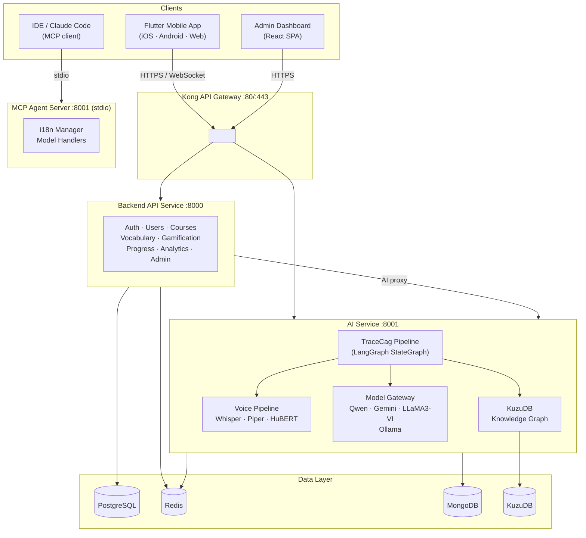

<div align="center">


# LexiLingo

### The AI English Tutor That Actually Understands You

**GraphCAG · Real-Time Voice · Knowledge Graph · CEFR Assessment**

---

[](https://flutter.dev)
[](https://fastapi.tiangolo.com)
[](https://www.python.org)
[](https://langchain-ai.github.io/langgraph/)
[](LICENSE)
[](https://github.com/InfinityZero3000/LexiLingo)

<br/>

> *Most language apps give you the same lesson regardless of who you are.* 
> *LexiLingo builds a live knowledge graph of your concept gaps, diagnoses errors in real time,* 
> *and generates personalized explanations — not templates.*

<br/>

[**Quick Start**](#6-getting-started) · [**Architecture**](#2-architecture-overview) · [**API Overview**](#9-api--service-overview) · [**GraphCAG**](#10-ai--graphcag--knowledge-graph)

</div>

---

## 1. Project Overview

LexiLingo is a full-stack AI English tutoring platform built as a **monorepo with 5 deployable services**. It combines a Flutter mobile app, a FastAPI backend, a Python AI service, a React admin dashboard, and an MCP agent server.

### Target users

| User type | Description |
|-----------|-------------|
| **Learner** | English learner (A1–C2) using the mobile app for lessons, vocabulary, AI chat, voice practice |
| **Admin** | Content manager / super-admin using the dashboard to manage users, courses, and system config |
| **Developer / Agent** | IDE tool users and AI agents accessing the MCP server for localization and graph tooling |

### Core capabilities

- **Adaptive vocabulary** — SM-2 spaced repetition with per-user ease factor (EF-adjusted intervals)
- **Structured courses** — CEFR-tagged A1→C2 curriculum with units, lessons, and exercises
- **AI tutor (Lexi Chat)** — Contextual conversation powered by the GraphCAG pipeline
- **Topic-based chat** — Conversation practice across 50+ topic catalogs
- **Voice / pronunciation** — Real-time dual-stream STT/TTS + HuBERT phoneme analysis with Vietnamese-specific error feedback
- **CEFR proficiency assessment** — Multi-skill diagnostic (grammar, vocabulary, fluency)
- **Gamification** — XP, leagues, achievements, shop, leaderboard, streaks
- **Knowledge graph** — Live KuzuDB graph of learner concept mastery, updated per interaction
- **Admin dashboard** — Full CMS for courses, vocabulary, users, analytics, and AI model config
- **Content feed** — Books, news articles (BBC Learning English), podcasts, YouTube clips

---

## 2. Architecture Overview

The system is organized into 8 architectural layers:

| Layer | Role | Primary tech |
|-------|------|-------------|
| **Flutter Mobile App** | Cross-platform learner UI (iOS / Android / Web) | Dart 3.8, Flutter 3.24, Provider, GetIt |
| **Backend API Service** | REST API, auth, data persistence, business logic | Python 3.11, FastAPI, SQLAlchemy 2 async, PostgreSQL, Redis |
| **AI Service** | LLM orchestration, knowledge graph, voice pipeline | Python 3.11, FastAPI, LangGraph, KuzuDB, Faster-Whisper, Piper, HuBERT |
| **Admin Dashboard** | Content management and monitoring SPA | TypeScript, React 18, Vite, Zustand, Recharts |
| **MCP Agent Server** | IDE integration tools via Model Context Protocol | Python, MCP SDK, stdio transport |
| **Infrastructure & Deployment** | Container orchestration, API gateway, observability | Docker Compose, Kong Gateway, PostgreSQL, Redis, MongoDB |
| **CI/CD Pipelines** | Automated test, build, deploy, i18n sync | GitHub Actions |
| **Documentation** | Architecture docs, feature plans, i18n guides | Markdown |

### System diagram



### Why GraphCAG over RAG?

| | Traditional RAG | LexiLingo GraphCAG |
|-|----------------|--------------------|
| **Context source** | Static document chunks | Live KuzuDB knowledge graph + Redis learner cache |
| **Personalization** | None — same docs for everyone | Per-user mastery scores, error history, CEFR level |
| **Retrieval latency** | Vector search on every turn | Pre-cached learner profile + graph BFS |
| **Curriculum awareness** | Zero | Prerequisite chains: "Past Simple → Past Perfect → Reported Speech" |
| **Error diagnosis** | Not possible | Dedicated Diagnose node maps errors to KG concept IDs |

---

## 3. Key Features

| Feature | Description | Main layer |
|---------|-------------|-----------|
| GraphCAG AI Tutor | Responses grounded in learner's live knowledge graph via TraceCag pipeline | AI Service |
| CEFR Assessment | Multi-skill proficiency test (grammar 40%, vocabulary 30%, fluency 30%) | AI Service + Backend |
| Spaced Repetition | SM-2 algorithm with per-user ease factor and overdue priority queue | Backend |
| Voice Pronunciation | Dual-stream WebSocket: simultaneous STT (Whisper) + TTS (Piper) + HuBERT phoneme scoring | AI Service |
| Structured Curriculum | CEFR A1–C2 courses, units, lessons with XP rewards | Backend + Mobile |
| Gamification | XP, level-up, leagues, weekly challenges, achievements, in-app shop | Backend + Mobile |
| Topic Chat | AI conversations on 50+ topic catalogs (cached context bundles) | AI Service |
| Content Feed | Books, BBC Learning English articles, podcasts, YouTube clips | Backend + Mobile |
| Admin CMS | Full CRUD for courses, vocabulary, users + analytics and AI model config | Admin Dashboard |
| MCP IDE Tools | i18n key manager, local model handlers for developer workflow | MCP Server |
| Multi-language UI | 7 locales: English, Vietnamese, Japanese, Korean, Chinese, French, Spanish | Mobile |
| Offline Support | sqflite local cache for vocabulary and progress | Mobile |

---

## 4. Tech Stack

| Area | Technology |
|------|-----------|
| **Mobile** | Flutter 3.24+, Dart 3.8, Provider, GetIt, sqflite, Dio/http |
| **Frontend (Admin)** | React 18, TypeScript 6, Vite, Zustand 5, Recharts, TanStack Query 5 |
| **Backend** | Python 3.11, FastAPI 0.136+, SQLAlchemy 2 async, Alembic, Pydantic v2 |
| **AI Orchestration** | LangGraph 1.2+, LangChain Core |
| **LLM (Local)** | Qwen2.5-1.5B (4-bit), LLaMA3-VI 3B (lazy-loaded), Ollama (qwen3 1.7b) |
| **LLM (Cloud)** | Google Gemini 2.5 Flash (primary cloud fallback), Groq (qwen3-32b) |
| **Voice STT** | Faster-Whisper (base–small, int8, CUDA) |
| **Voice TTS** | Piper TTS (en_US-lessac-medium.onnx) |
| **Pronunciation** | HuBERT-large-ls960-ft (Facebook), sentence-transformers |
| **Knowledge Graph** | KuzuDB 0.11+ (embedded graph DB) |
| **Vector Embeddings** | all-MiniLM-L6-v2 (sentence-transformers) |
| **Primary DB** | PostgreSQL 14+ (asyncpg) |
| **Cache / Sessions** | Redis 7 |
| **AI Logs / History** | MongoDB (Motor async driver) |
| **Auth** | JWT (RS256, python-jose), Firebase Admin SDK, Google OAuth 2.0 |
| **API Gateway** | Kong (rate limiting, auth, routing) |
| **Container** | Docker Compose (production multi-service stack) |
| **CI/CD** | GitHub Actions (ci.yml, cd.yml, crowdin-sync.yml) |
| **i18n** | Crowdin (synced via GitHub Action) |
| **MCP** | Model Context Protocol Python SDK (stdio transport) |

---

## 5. Repository Structure

```
LexiLingo/
├── flutter-app/ # Flutter mobile/web app (Dart)
│ ├── lib/
│ │ ├── core/ # DI, network, shared utilities
│ │ └── features/ # 21 feature modules (auth, learning, chat, voice…)
│ ├── assets/ # i18n JSON, images, Lottie animations
│ └── pubspec.yaml
│
├── backend-service/ # FastAPI REST API (Python)
│ ├── app/
│ │ ├── core/ # Config, DB, security, middleware, Redis
│ │ ├── models/ # SQLAlchemy ORM models
│ │ ├── schemas/ # Pydantic request/response schemas
│ │ ├── routes/ # 24 route groups (auth, courses, gamification…)
│ │ ├── crud/ # Async DB operations
│ │ └── services/ # Business logic (level, rank, item effects…)
│ ├── alembic/ # DB migrations
│ ├── tests/
│ └── requirements.txt
│
├── ai-service/ # AI / ML service (Python)
│ ├── api/
│ │ ├── core/ # Config, auth, Redis, quota guard, rate limiter
│ │ ├── routes/ # chat, stt, tts, topics, lexi_chat, pronunciation…
│ │ ├── services/
│ │ │ ├── trace_cag/ # LangGraph TraceCag pipeline (state, nodes, graph, edges)
│ │ │ ├── dual_stream/ # Real-time WebSocket STT/TTS orchestration
│ │ │ ├── handlers/ # Model handlers (Whisper, HuBERT, Piper, Qwen, Gemini)
│ │ │ ├── kg_service_v3.py # KuzuDB graph engine
│ │ │ └── embedding_service_v3.py
│ │ └── models/ # Pydantic schemas
│ ├── data/ # KG seed JSON, topic graphs, knowledge base
│ ├── scripts/ # Model download, KG build, DB init
│ └── requirements.txt
│
├── admin-service/ # React admin dashboard (TypeScript)
│ ├── src/
│ │ ├── components/ # Shared UI + dashboard charts + login globe
│ │ ├── pages/ # 18 pages (users, courses, monitoring, AI models…)
│ │ └── lib/ # API clients, auth, i18n, RBAC
│ └── package.json
│
├── mcp-server/ # MCP agent server (Python, IDE tools)
│ ├── handlers/ # Gemini, Whisper, Piper, Qwen handlers
│ ├── tools/ # i18n manager
│ └── server.py # MCP server entry point
│
├── gateway/ # Kong API gateway config + observability
├── scripts/ # Dev/deploy shell scripts (start-all, deploy, smoke…)
├── docs/ # Architecture docs, feature plans
├── .github/workflows/ # CI/CD pipelines
├── docker-compose.yml # Local dev compose
├── docker-compose.production.yml
└── Makefile # Flutter convenience targets
```

---

## 6. Getting Started

### Prerequisites

| Tool | Version |
|------|---------|
| Python | 3.11+ |
| Flutter | 3.24+ |
| Node.js | 18+ (for admin dashboard) |
| PostgreSQL | 14+ |
| Redis | 7+ |
| Docker & Docker Compose | Latest (optional but recommended) |

### Option A — Docker (recommended)

```bash
git clone https://github.com/InfinityZero3000/LexiLingo.git
cd LexiLingo

# Copy and fill environment variables
cp .env.example .env # root-level env for compose
cp backend-service/.env.example backend-service/.env
cp ai-service/.env.example ai-service/.env

# Start all services (postgres, redis, mongodb, backend, ai-service)
docker-compose up -d
```

### Option B — All services locally (no Docker)

```bash
bash scripts/start-all.sh
```

This script starts the backend, AI service, and Flutter web in the background, writing logs to `logs/`.

### Manual setup per service

#### Backend API

```bash
cd backend-service
python -m venv venv && source venv/bin/activate
pip install -r requirements.txt
cp .env.example .env # fill DATABASE_URL, SECRET_KEY, etc.

createdb lexilingo
alembic upgrade head # run DB migrations

uvicorn app.main:app --reload --port 8000
```

#### AI Service

```bash
cd ai-service
bash setup.sh # creates venv, installs deps, copies .env
source venv/bin/activate
# fill .env: GEMINI_API_KEY, KUZU_DB_PATH, REDIS_URL, etc.
uvicorn api.main:app --reload --port 8001
```

#### Flutter Mobile App

```bash
cd flutter-app
flutter pub get
cp .env.example assets/env/.env # set API_BASE_URL

flutter run # default device
make run-web # Chrome
make run-ios # iOS simulator
make run-android # Android emulator/device
```

#### Admin Dashboard

```bash
cd admin-service
pnpm install
cp .env.example .env # set VITE_BACKEND_URL, VITE_AI_URL
pnpm dev # dev server at http://localhost:5173
```

---

## 7. Environment Variables

### Backend (`backend-service/.env`)

| Variable | Description | Required |
|----------|-------------|----------|
| `DATABASE_URL` | PostgreSQL async URL (`postgresql+asyncpg://...`) | Yes |
| `SECRET_KEY` | JWT signing secret (use `openssl rand -hex 32`) | Yes |
| `ALGORITHM` | JWT algorithm (default: `HS256`) | Yes |
| `REDIS_URL` | Redis connection URL | Yes |
| `FIREBASE_PROJECT_ID` | Firebase project for token verification | Optional |
| `FIREBASE_CREDENTIALS_JSON` | Firebase Admin SDK credentials (JSON string) | Optional |
| `SMTP_HOST` / `SMTP_USERNAME` / `SMTP_PASSWORD` | Email (password reset, verification) | Optional |
| `AI_SERVICE_URL` | Internal URL to AI service (default: `http://localhost:8001/api/v1`) | Optional |
| `ALLOWED_ORIGINS` | CORS origins (comma-separated) | Yes |

### AI Service (`ai-service/.env`)

| Variable | Description | Required |
|----------|-------------|----------|
| `GEMINI_API_KEY` | Google Gemini API key | Yes |
| `GEMINI_MODEL` | Model name (default: `gemini-2.5-flash`) | Yes |
| `GROQ_API_KEY` | Groq API key (optional cloud fallback) | Optional |
| `KUZU_DB_PATH` | Path to KuzuDB data directory | Yes |
| `REDIS_URL` | Redis URL for subgraph cache | Yes |
| `MONGODB_URI` | MongoDB URI for logs and chat history | Yes |
| `OLLAMA_BASE_URL` | Ollama server URL (default: `http://localhost:11434`) | Optional |
| `WHISPER_MODEL_SIZE` | `tiny` / `base` / `small` / `medium` | Optional |
| `PIPER_MODEL_PATH` | Path to `.onnx` voice model | Optional |
| `HUBERT_MODEL_ID` | HuBERT model ID (default: `facebook/hubert-large-ls960-ft`) | Optional |
| `BACKEND_SERVICE_URL` | Backend URL for cross-service calls | Yes |

See `.env.example` in each service directory for the full list.

---

## 8. Available Scripts / Commands

### Root

```bash
bash scripts/start-all.sh # Start backend + AI service + Flutter web locally
bash scripts/stop-all.sh # Stop all local services
bash scripts/status.sh # Check running service status
bash scripts/smoke-prod.sh # Run production smoke tests
docker-compose up -d # Start all services via Docker
docker-compose down # Stop Docker services
```

### Flutter (via Makefile)

```bash
make get # flutter pub get
make test # flutter test
make analyze # flutter analyze
make format # dart format
make run-web # Run on Chrome
make run-ios # Run on iOS simulator
make run-android # Run on Android device
make build-web # Build web release
make build-apk # Build Android APK
```

### Backend

```bash
alembic upgrade head # Apply DB migrations
alembic revision --autogenerate -m "description" # Create migration
uvicorn app.main:app --reload # Development server
pytest tests/ # Run tests
```

### Admin Dashboard

```bash
pnpm dev # Dev server (http://localhost:5173)
pnpm build # Production build to dist/
pnpm preview # Preview production build
```

---

## 9. API / Service Overview

All external requests route through **Kong Gateway** (`:80`/`:443` in production).

### Backend API — `/api/v1/`

| Group | Prefix | Description |
|-------|--------|-------------|
| Auth | `/auth` | Register, login, refresh token, Firebase exchange, Google OAuth |
| Users | `/users` | Profile CRUD, avatar |
| Courses | `/courses` | Course catalog (CEFR-tagged units and lessons) |
| Vocabulary | `/vocabulary` | Word bank, SM-2 review scheduling |
| Learning | *(root)* | Session tracking, lesson completion |
| Progress | *(root)* | Streak, enrollment, roadmap |
| Gamification | *(root)* | XP, achievements, wallet, leaderboard, shop, social |
| Challenges | *(root)* | Weekly challenges |
| Games | *(root)* | Game session management |
| Proficiency | *(root)* | CEFR multi-skill assessment |
| Admin | *(root)* | Content management (courses, vocabulary, grammar) |
| Analytics | *(root)* | DAU/MAU, retention, engagement metrics |
| Monitoring | *(root)* | Service health, AI model status |
| AI Audit | *(root)* | AI request/response audit log |
| Content | `/books`, `/news`, `/podcasts`, `/youtube` | External content feeds |

Full OpenAPI docs available at `http://localhost:8000/docs` when running locally.

### AI Service — `/api/v1/`

| Group | Prefix | Description |
|-------|--------|-------------|
| Lexi Chat | `/lexi` | AI tutor session (TraceCag, full state management) |
| Chat | `/chat` | General conversation endpoint |
| Topic Chat | `/topics` | Topic-based conversation catalog and sessions |
| STT | `/stt` | Speech-to-text (Faster-Whisper) |
| Pronunciation | `/stt` | Phoneme scoring and feedback (HuBERT) |
| TTS | `/tts` | Text-to-speech synthesis (Piper) |
| WebSocket | `/ws/stream` | Dual-stream real-time voice session |
| AI Analytics | `/ai` | Model health and usage metrics |
| Admin | `/admin` | AI model config and management |

---

## 10. AI / GraphCAG / Knowledge Graph

### TraceCag Pipeline

The AI tutor's intelligence is powered by a **LangGraph StateGraph** (in `ai-service/api/services/trace_cag/`):

```
User input
 │
 ▼
┌────────────────────────────────────────────────────┐
│ TraceCag LangGraph Pipeline │
│ │
│ DIAGNOSE ──▶ RETRIEVE ──▶ GROUND ──▶ GENERATE │
│ │
│ Classify KuzuDB BFS Merge KG Qwen2.5 │
│ error type + Vector + learner → Gemini │
│ Map to KG + Redis L0 profile into (cloud │
│ concept ID cache LLM prompt fallback)│
└────────────────────────────────────────────────────┘
 │
 ▼
Response grounded in this learner's personal concept graph
```

Key source files:

| File | Purpose |
|------|---------|
| `trace_cag/state.py` | `GraphCAGState` TypedDict (shared pipeline state) |
| `trace_cag/nodes_v2.py` | All 4 node implementations (Diagnose, Retrieve, Ground, Generate) |
| `trace_cag/graph.py` | LangGraph graph wiring + conditional routing |
| `trace_cag/edges.py` | Edge routing logic |
| `kg_service_v3.py` | KuzuDB engine: TF-IDF index, CEFR-weighted BFS, Redis subgraph cache |
| `embedding_service_v3.py` | all-MiniLM-L6-v2 sentence embeddings |
| `retrieval_service_v3.py` | Orchestrates KG + vector retrieval |

### Knowledge graph location

- **Runtime graph DB**: `ai-service/data/kuzu_db/` (KuzuDB embedded)
- **Seed concept data**: `ai-service/data/kg/*.json`
- **Codebase knowledge graph** (architecture graph built by `/understand`): 
 `.understand-anything/knowledge-graph.json`

### Rebuild / explore the codebase knowledge graph

```bash
# Rebuild (in Claude Code)
/understand-anything:understand

# Open interactive dashboard
/understand-anything:understand-dashboard
# → http://127.0.0.1:5173/?token=<TOKEN>
```

The codebase graph covers **1,844 nodes, 2,174 edges** across all 5 service layers.

---

## 11. Development Notes

### Reading the codebase

- **Start here**: `backend-service/app/main.py` (wires all 24 routes) and `ai-service/api/main.py` (wires all AI routes)
- **Data models**: `backend-service/app/models/` — SQLAlchemy ORM, all tables defined here
- **API contracts**: `backend-service/app/schemas/` — Pydantic v2 input/output schemas
- **AI pipeline**: `ai-service/api/services/trace_cag/` — LangGraph nodes, state, edges
- **Flutter features**: each feature module follows `data / domain / presentation` layers

### Understanding the layers

The codebase knowledge graph (built by `understand-anything`) maps all imports, class relationships, and tested-by edges. Use it to trace which files a change could affect:

```bash
# Interactive architecture explorer
/understand-anything:understand-dashboard

# Or ask questions about the codebase
/understand-anything:understand-chat
```

### After large code changes

Rebuild the knowledge graph to keep architecture docs current:

```bash
/understand-anything:understand --full
```

### Checking cross-service dependencies

The knowledge graph shows 8 isolated layers with no cross-service import edges (each service is a separate Python/Dart/TS runtime). Cross-service calls are made via HTTP through Kong gateway — trace them by searching for `AI_SERVICE_URL` or `BACKEND_SERVICE_URL` in env config.

---

## 12. Roadmap

- [ ] Expand automated test coverage (backend integration tests, Flutter widget tests)
- [ ] FSRS v5 spaced repetition (currently SM-2)
- [ ] Speaking fluency score (prosody + rhythm, not just phoneme accuracy)
- [ ] Writing assessment module
- [ ] Expand knowledge graph concepts (IELTS, Business English, Academic vocabulary)
- [ ] Admin analytics: learner cohort analysis and retention funnel
- [ ] Improve deployment docs (Kubernetes / Render / Railway configs)
- [ ] GraphCAG evaluation benchmarks (retrieval accuracy, grounding quality)

---

## 13. Contributing

Contributions are welcome — especially on the AI pipeline, Flutter UI, and test coverage.

See [CONTRIBUTING.md](CONTRIBUTING.md) for guidelines on branch naming, commit style, and PR review process.

---

## 14. License

MIT License — see [LICENSE](LICENSE) for full text.

```
Copyright (c) 2026 Nguyen Thang
```

---

<div align="center">

[Architecture Docs](docs/ARCHITECTURE.md) · [Report Issue](https://github.com/InfinityZero3000/LexiLingo/issues) · [Discussions](https://github.com/InfinityZero3000/LexiLingo/discussions)

Built by [InfinityZero3000](https://github.com/InfinityZero3000)

</div>
