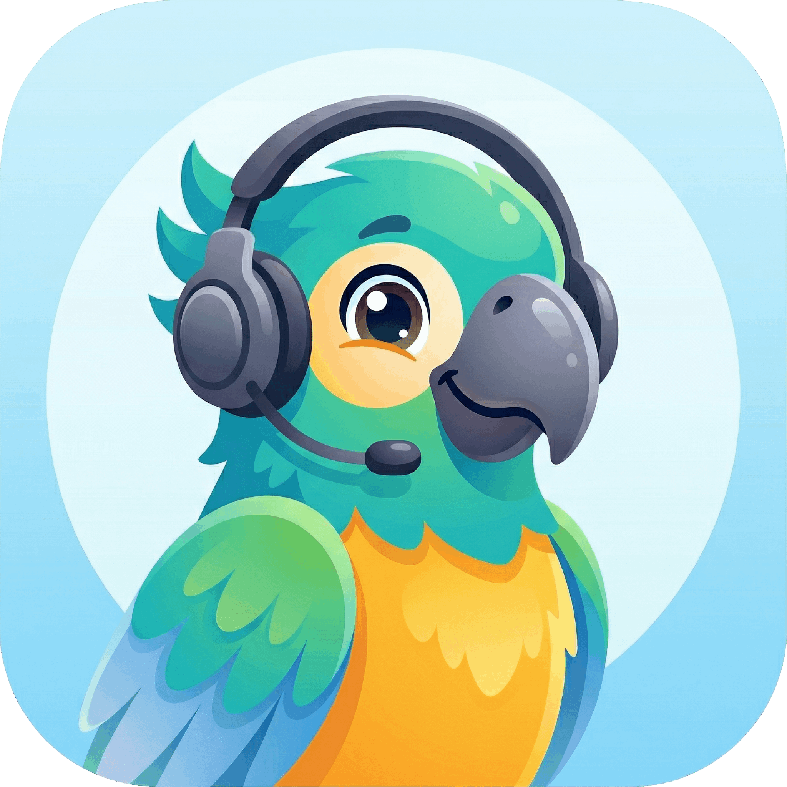

<div align="center">



# LexiLingo

### The AI English Tutor That Actually Understands You

**GraphCAG · Real-Time Voice · Knowledge Graph · CEFR Assessment**

---

[](https://flutter.dev)
[](https://fastapi.tiangolo.com)
[](https://www.python.org)
[](https://langchain-ai.github.io/langgraph/)
[](LICENSE)
[](https://github.com/InfinityZero3000/LexiLingo)
[](https://github.com/InfinityZero3000/LexiLingo/stargazers)

<br/>

> *Most language apps give you the same lesson regardless of who you are.*
> *LexiLingo builds a live knowledge graph of your gaps, diagnoses your errors in real time,*
> *and generates personalized explanations — not templates.*

<br/>

[**Get Started**](#quick-start) · [**Architecture**](#architecture) · [**Why GraphCAG?**](#why-graphcag-over-rag) · [**Features**](#features)

</div>

---

## What Makes LexiLingo Different

| Traditional Apps | LexiLingo |
|-----------------|-----------|
| Fixed curriculum for all learners | Knowledge Graph maps YOUR concept gaps |
| Generic AI explanations | GraphCAG grounds every response in your mastery state |
| Slow responses from heavy RAG | Redis-cached context → sub-second grounding |
| One language model for everything | Smart Router picks the right model per task |
| No pronunciation depth | HuBERT phoneme analysis with Vietnamese-specific patterns |
| Fixed review intervals | SuperMemo-2 spaced repetition, EF-adjusted per concept |

---

## Why GraphCAG over RAG?

> RAG retrieves from documents. **GraphCAG grounds responses in a live knowledge graph of the learner.**

| | Traditional RAG | LexiLingo GraphCAG |
|-|----------------|--------------------|
| **Context source** | Static document chunks | Live KuzuDB knowledge graph + Redis learner cache |
| **Personalization** | None — same docs for everyone | Per-user mastery scores, error history, CEFR level |
| **Retrieval latency** | Vector search on every turn | Pre-cached learner profile, graph hop expansion |
| **Curriculum awareness** | Zero — just similarity search | Prerequisite chains: "Past Simple → Past Perfect → Reported Speech" |
| **Error diagnosis** | Not possible | Dedicated Diagnose node maps errors to KG concept IDs |
| **Routing logic** | Single retrieval path | Conditional edges: low-confidence → clarify, A1/A2 errors → Vietnamese bridge |
| **State between turns** | Stateless or basic memory | Full `GraphCAGState` TypedDict persisted across turns |

**Result:** Responses feel like a real tutor who remembers everything about you — not a chatbot that reads from a wiki.

---

## Architecture

```
Flutter App (iOS · Android · Web)
         │
    API Gateway (Kong / Nginx)
         │
    ┌────┴────┬──────────────┐
    ▼         ▼              ▼
Backend    AI Service     Admin
(FastAPI)  (FastAPI)    (React+Vite)
    │         │
PostgreSQL  Redis + KuzuDB
```

### GraphCAG Pipeline (LangGraph StateGraph)

The core of LexiLingo's intelligence — a 7-node stateful graph that replaces naive RAG:

```
INPUT ──▶ KG_EXPAND ──▶ DIAGNOSE
               (KuzuDB)     (Error→KG IDs)
                                │
              ┌─────────────────┼──────────────┐
              ▼                 ▼              ▼
         ASK_CLARIFY      VIETNAMESE        RETRIEVE
         (conf < 0.5)    (A1/A2 bridge)  (KG + Cache)
              │                 │              │
              └─────────────────┴──────────────┘
                                │
                            GENERATE
                            (LLM + CAG)
                                │
                       ┌────────┴────────┐
                       ▼                 ▼
                      TTS              END
```

Each node is a pure `async def node(state) -> dict` updating a shared `GraphCAGState`. LangGraph handles conditional routing, retries, and state checkpointing.

### Smart Model Router

```
User Input
    │
    ▼
Complexity Analysis
    │
    ├─ Simple greeting   →  gemma2:2b  (local, ~3s)
    ├─ Grammar / tech    →  Gemini     (cloud, ~2s)
    └─ Deep analysis     →  qwen3:4b   (local, ~20s)

Fallback chain: OpenRouter → Gemini → Ollama
```

### Dual-Stream Real-Time Voice

Three async streams running concurrently:

```
LISTENING  ──▶  THINKING  ──▶  SPEAKING
(VAD + STT)    (GraphCAG)    (Chunked TTS)
     │                              │
     ◄────── INTERRUPTION ──────────┘
```

User can interrupt the AI mid-sentence. TTS stops immediately, STT resumes.

---

## Features

### AI & Learning Engine
- **GraphCAG Pipeline** — Knowledge Graph + Cache-Augmented Generation via LangGraph
- **CEFR Assessment** — Auto-scoring A1→C2 across grammar (40%), vocabulary (30%), fluency (30%)
- **HuBERT Pronunciation** — IPA phoneme analysis with Vietnamese-specific error patterns (θ→t, ʃ→s, ð→d)
- **SM-2 Spaced Repetition** — EF-adjusted review intervals, overdue priority queue
- **Content Auto-Generation** — Exercises targeting your exact error patterns, not generic templates

### Voice Pipeline
- Real-time VAD → Streaming STT (Whisper) → GraphCAG → Chunked TTS (Piper)
- Interruption handling — speak over the AI at any time
- Partial transcript updates during speech

### Knowledge Graph (KuzuDB)
- Grammar concepts from A1 basics to C2 advanced
- Prerequisite chain traversal for next-best-concept recommendations
- Per-user mastery scores updated live after each interaction

### Cross-Platform App
- Flutter 3.24+ — iOS, Android, Web from a single codebase
- Offline-first with SQLite local storage
- 7 locales: English, Vietnamese, Japanese, Korean, Chinese, French, Spanish

---

## Technology Stack

| Layer | Technology |
|-------|-----------|
| AI Orchestration | LangGraph StateGraph |
| LLM (Cloud) | Google Gemini API |
| LLM (Local) | Ollama (gemma2, qwen3) · Qwen2.5 LoRA fine-tune |
| Pronunciation | HuBERT-large (Facebook) |
| STT / TTS | Whisper · Piper |
| Knowledge Graph | KuzuDB |
| Backend | FastAPI · PostgreSQL 14+ · Redis · SQLAlchemy |
| Frontend | Flutter 3.24+ · Provider · Dio |
| Infrastructure | Docker Compose · Kong Gateway |

---

## Quick Start

**Prerequisites:** Python 3.11+, Flutter 3.24+, PostgreSQL 14+, Docker (optional)

```bash
git clone https://github.com/InfinityZero3000/LexiLingo.git
cd LexiLingo
bash scripts/start-all.sh
```

```bash
# Docker
docker-compose up -d
```

---

## Contributing

Contributions are welcome — especially on the AI pipeline, Flutter UI, and benchmark tooling.

See [CONTRIBUTING.md](CONTRIBUTING.md) for guidelines.

---

<div align="center">

**If LexiLingo gave you ideas, a helps others find it.**

[Documentation](https://github.com/InfinityZero3000/LexiLingo/wiki) · [Report Issue](https://github.com/InfinityZero3000/LexiLingo/issues) · [Discussions](https://github.com/InfinityZero3000/LexiLingo/discussions)

MIT License · Built with by [InfinityZero3000](https://github.com/InfinityZero3000)

</div>
