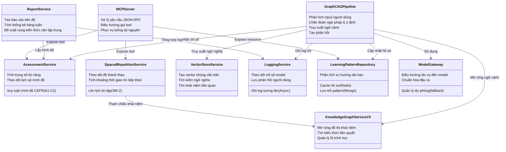

# Kiến trúc Dịch vụ AI LexiLingo

## 1. Tổng Quan

LexiLingo AI Service là một backend hiệu năng cao, được thiết kế theo dạng module để cung cấp khả năng gia sư tiếng Anh thông minh. Hệ thống sử dụng phương pháp **Clean Architecture** (Kiến trúc Sạch), tách biệt logic nghiệp vụ khỏi các vấn đề hạ tầng, và áp dụng **Graph-based Orchestration** (Điều phối dựa trên Đồ thị - LangGraph) để quản lý các tương tác AI phức tạp.

Hệ thống đã phát triển qua 3 giai đoạn chính:
1.  **Nền tảng (Foundation)**: Hệ thống ghi log cốt lõi, lưu trữ hồ sơ người dùng, và pipeline đồ thị cơ bản.
2.  **Thông minh (Intelligence)**: Đánh giá người dùng (CEFR), lặp lại ngắt quãng (SM-2), và tìm kiếm ngữ nghĩa.
3.  **Tích hợp (Integration)**: Model Context Protocol (MCP) server, streaming SSE, và báo cáo tiến độ.

---

## 2. Kiến trúc Hệ thống (UML)

---

## 3. Phân tích Chi tiết Thành phần

### 3.1 Tầng Điều phối (`GraphCAGPipeline`)
Trái tim của hệ thống là **Pipeline Tạo nội dung Tự động (CAG)**, được triển khai bằng LangGraph. Nó coi quá trình hội thoại như một máy trạng thái với các node riêng biệt:
*   **Diagnose Node (Chẩn đoán)**: Phân tích input của người dùng để tìm lỗi ngữ pháp, ý định và độ trôi chảy.
*   **Retrieve Node (Truy xuất)**: Lấy ngữ cảnh liên quan bằng **Vector Search** (ngữ nghĩa) và **Knowledge Graph** (cấu trúc).
*   **Generate Node (Tạo sinh)**: Tạo phản hồi AI cuối cùng bằng LLM (Qwen/Gemini) phù hợp với trình độ người dùng.
*   **Review Node (Đánh giá)**: (Tùy chọn) Vòng lặp tự sửa lỗi cho các phản hồi quan trọng.

### 3.2 Các Dịch vụ Thông minh (Intelligence Services)
*   **Assessment Service (Đánh giá)**: Tự động xác định trình độ CEFR (A1-C2) của người dùng dựa trên lịch sử tương tác. Dùng mô hình tính điểm có trọng số (40% Ngữ pháp, 30% Từ vựng, 30% Độ trôi chảy) và theo dõi tiến độ theo thời gian.
*   **Spaced Repetition Service (Lặp lại ngắt quãng)**: Triển khai **Thuật toán SM-2** để lên lịch ôn tập. Đảm bảo người dùng ôn lại từ vựng và ngữ pháp vào các khoảng thời gian tối ưu để ghi nhớ tốt nhất.
*   **Vector Store Service (Lưu trữ Vector)**: Cung cấp khả năng hiểu ngữ nghĩa. Nhúng (embed) các khái niệm và câu hỏi người dùng vào không gian vector để tìm kiếm sự trùng khớp ngay cả khi không giống nhau về từ khóa (ví dụ: khớp "xe hơi" với "phương tiện").
*   **Knowledge Graph Service (Đồ thị Tri thức)**: Quản lý các mối quan hệ có cấu trúc giữa các kiến thức (ví dụ: "Thì quá khứ" *yêu cầu* "Các dạng động từ").

### 3.3 Tầng Tích hợp (Integration - MCP & API)
*   **MCP Server**: Triển khai giao thức **Model Context Protocol**, cho phép các trợ lý AI bên ngoài (như Claude Desktop hoặc IDE) kết nối với LexiLingo. Nó cung cấp các công cụ (`analyze_text`, `assess_level`) và tài nguyên (`learner_profile`).
*   **FastAPI Routes**: Cung cấp các REST endpoint tiêu chuẩn và **SSE (Server-Sent Events)** để truyền text theo thời gian thực (streaming), đảm bảo trải nghiệm người dùng nhanh và mượt mà.

### 3.4 Dữ liệu & Lưu trữ (Persistence)
*   **MongoDB**: Lưu trữ dữ liệu chính—Log tương tác, hồ sơ người dùng, bài đánh giá và báo cáo.
*   **Redis**: Cache dữ liệu "nóng" như Hồ sơ người dùng và các truy vấn Knowledge Graph thường xuyên để truy cập độ trễ thấp.
*   **Logging Service**: Bộ ghi log tập trung bất đồng bộ (async), ghi lại mọi tương tác để phân tích mà không chặn luồng phản hồi chính.

---

## 4. Ví dụ Luồng Dữ liệu: "I go to school yesterday."

1.  **Input**: Người dùng gửi "I go to school yesterday."
2.  **Chẩn đoán (Diagnose)**: 
    *   `GraphCAGPipeline` phát hiện lỗi ngữ pháp (Thì động từ). 
    *   Sửa lỗi: "go" -> "went".
3.  **Cập nhật Hồ sơ (Update Profile)**:
    *   `LearningPatternRepository` ghi nhận mẫu lỗi ("verb_tense").
    *   `AssessmentService` giảm nhẹ điểm ngữ pháp chi tiết.
4.  **Truy xuất (Retrieval)**:
    *   `VectorStoreService` tìm bài học liên quan về "Past Simple" (Quá khứ đơn).
    *   `KnowledgeGraphService` tìm các khái niệm liên quan (ví dụ: "động từ bất quy tắc").
5.  **Tạo sinh (Generation)**:
    *   LLM tạo lời sửa + giải thích: "Bạn nên dùng 'went' cho hành động trong quá khứ."
    *   Phản hồi được stream qua **SSE** về client.
6.  **Hậu xử lý (Post-Processing)**:
    *   `SpacedRepetitionService` lên lịch ôn tập "Past Simple" vào ngày mai.
    *   `LoggingService` lưu toàn bộ giao dịch vào MongoDB.

---

## 5. Công nghệ Sử dụng
*   **Ngôn ngữ**: Python 3.11+
*   **Framework**: FastAPI, LangGraph
*   **Cơ sở dữ liệu**: MongoDB (Dữ liệu), Redis (Cache), KuzuDB (Knowledge Graph)
*   **Mô hình AI**: Qwen-2.5 (Local/Cloud), Gemini 1.5 Flash (Cloud)
*   **Giao thức**: HTTP/2, WebSocket, MCP (Model Context Protocol), SSE
